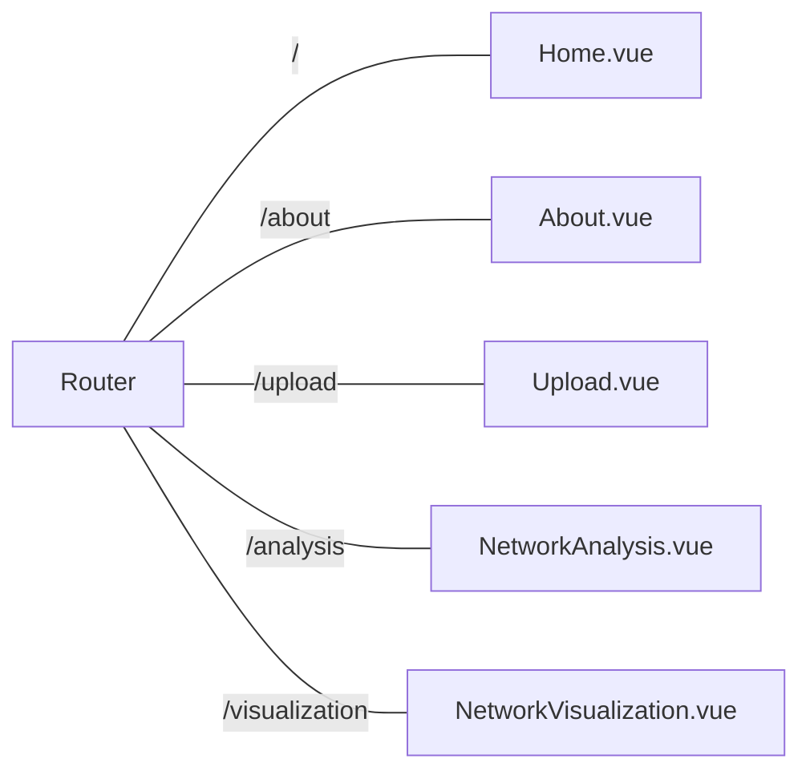
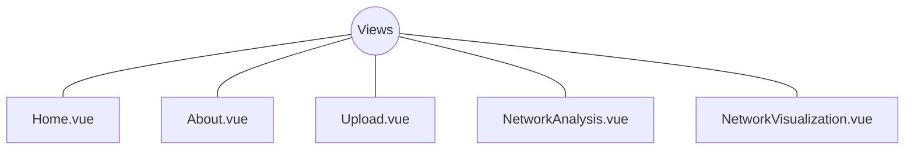
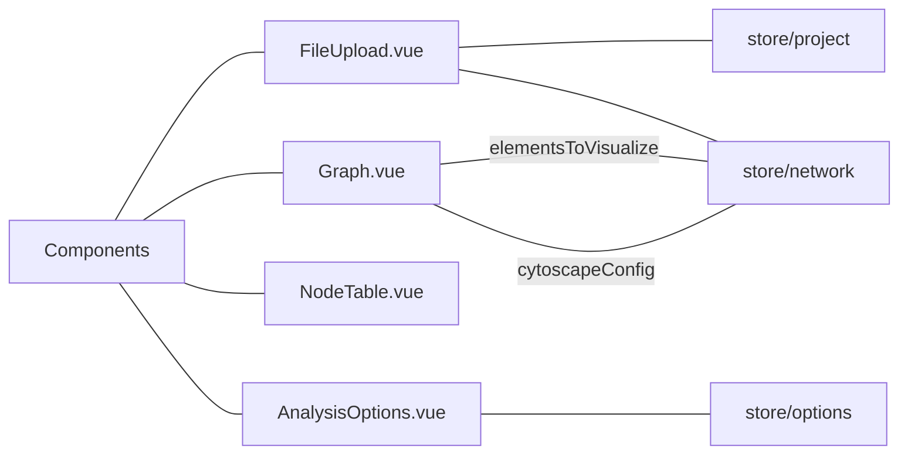
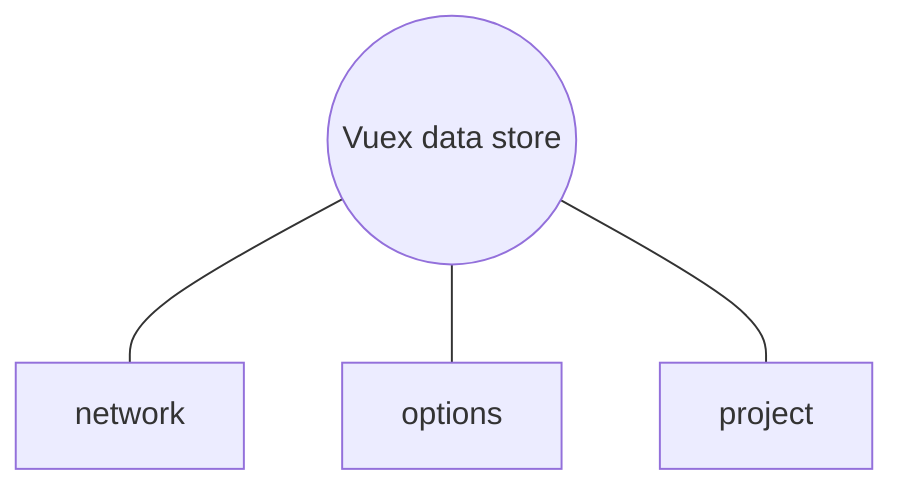

The Ontology Explorer is a Vue.js application. It's architecture utilizes various building blocks to create a user interface for analyzing and visualizing data models from ATLAS.ti projects. The following is a breakdown of these elements.

## Router

Vue Router is a library that helps manage navigation within the single-page Vue application. It maps different URLs (paths) to specific views. Next to the landing pages, the application defines routes for:

* ``/upload``: This route maps to the Upload.vue view, displaying the file upload page.
* ``/analysis``: This route maps to a view for analysis options configuration, NetworkAnalysis.vue.
* ``/visualization``: This route maps to the NetworkVisualization.vue view, displaying the network visualization page.

## Views

Views represent the different pages or screens that users see in the application. They consist of HTML templates that utilize components and  interact with the global state management store (Vuex). The Ontology Explorer application has views for:

* ``About.vue`` and ``Home.vue``: These are general pages providing information about the project and serving as landing pages for the application.
* ``Upload.vue``: This view incorporates the FileUpload.vue component, allowing users to upload ATLAS.ti project files.
* ``NetworkAnalysis.vue``: This view includes components like AnalysisOptions.vue and NodeTable.vue for configuring analysis options and displaying the output table.
* ``NetworkVisualization.vue``: This view utilizes the Graph.vue component to visualize the network graph generated from analysis data using Cytoscape.js.

## Components

Components are reusable building blocks that represent a specific part of your user interface. They encapsulate HTML structure, styles, and JavaScript logic for a particular functionality. The Ontology Explorer has the following components:

* ``FileUpload.vue``: This component allows users to upload ATLAS.ti project XML files. It uses Vue.js methods to handle file selection.
* ``AnalysisOptions.vue``: This component is responsible for displaying and handling analysis options, document groups, and set operations. It interacts with Vuex to update the application's central state based on user selections.
* ``NodeTable.vue``: This component is responsible for displaying the output table generated from network analysis.
* ``Graph.vue``: This component utilizes the cytoscape.js library to visualize the network generated from the analysis.

## State management

Vuex is used as the state management library for Vue.js applications. It provides a centralized store to hold and manage application state that can be accessed from the different component. In the application Vuex manages:

* ``network``: This state stores data related to the network for Cytoscape analysis and visualization.
* ``options``: This state manages analysis options selected by the user through components like AnalysisOptions.vue.
* ``project``: This state holds the processed ATLAS.ti project data.

## Utilities

The util directory likely contains helper functions and scripts that are separate from components. These utilities are mainly responsible for transforming ATLAS.ti project XML files into a format suitable for the Ontology Explorer. These utilities are invoked when processing uploaded project files.
