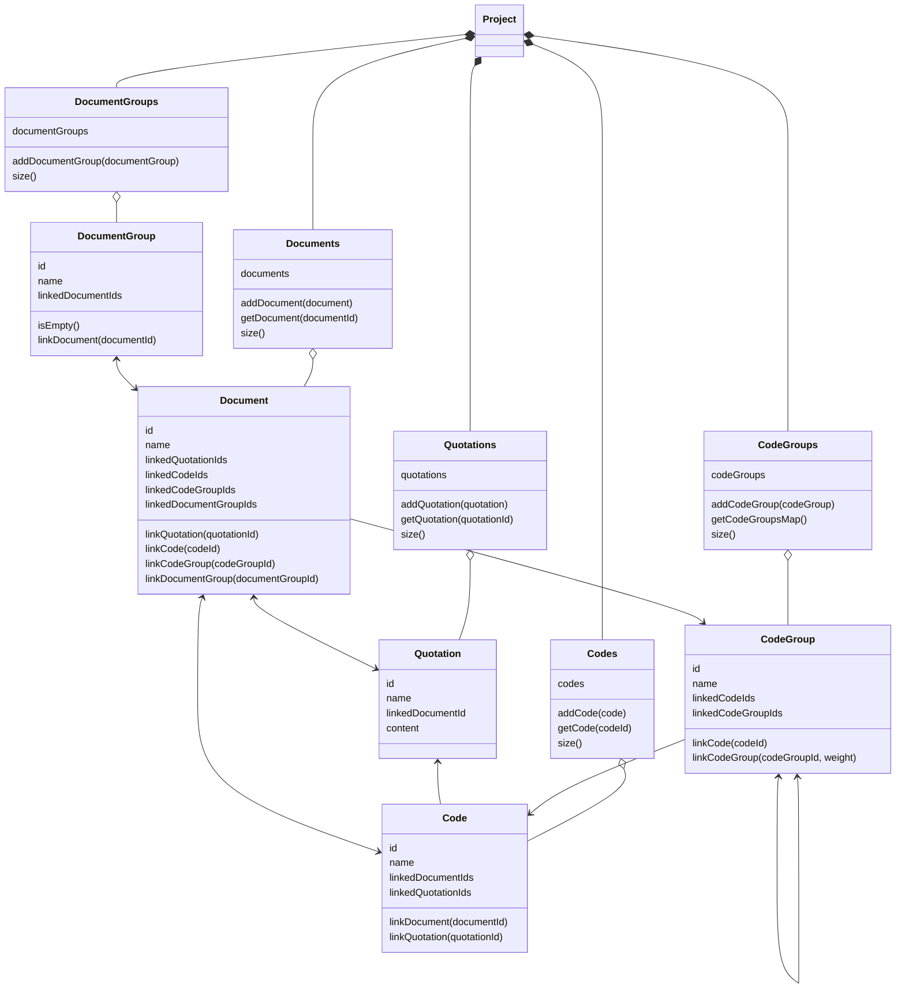
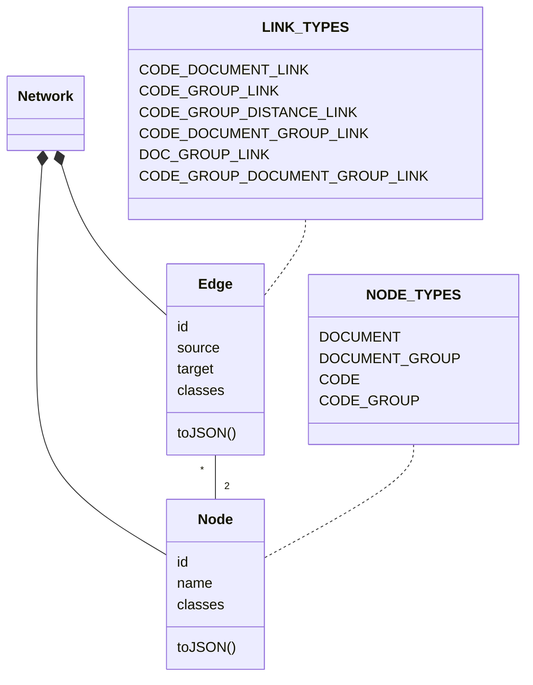

The following diagram visually represents the interconnected entities within the domain model of an ATLAS.ti project. At the core of the model is the ATLAS. ti project, which encompasses ``Document groups``, ``Documents``, ``Code Groups``, ``Codes``, and ``Quotes``.

``Document groups`` typically represent individual systems under analysis and may contain multiple ``Documents`` detailing the data model of a system.

Within ``Documents``, ``Quotes`` serve as in-vivo codings of categories of data, providing associations with ``Codes`` that represent these categories.

``Code groups`` serve the purpose of harmonization and grouping of ``Codes``, to model relations between them.

In the Ontology Explorer, the ATLAS.ti domain model is translated into a network structure comprising ``Nodes`` and ``Links`` used for analysis and visualization using [Cytoscape.js](https://js.cytoscape.org/).

Each entity from the Atlas.ti project is represented as a ``Node``, distinguished by its ``Type`` attribute. ``Links`` also have an attribute ``Type`` to model the different types of connections within the network, which are used in the analysis and visualization.

The following diagram illustrates this model.

