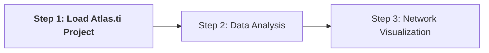
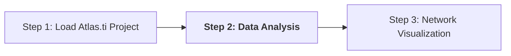
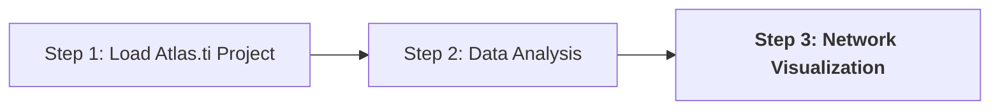

# Ontology Explorer Tutorial

This tutorial will guide you through using the Ontology Explorer application for analyzing and visualizing data from Atlas.ti projects.

**Note:** Before starting, ensure you have an Atlas.ti project file ready. If you haven't created one yet, refer to the tutorial page on starting a project for coding EU information systems for migration and border control. Alternatively, you can use one of the sample projects provided.

## Step 1: Loading a project file

> ℹ️ Please note that the project is not actually uploaded anywhere; rather, it is loaded into the local browser memory. Refreshing the page will remove the project from memory.

In this step, the application will take the Atlas.ti project file and transform the codes, code groups, documents, and document groups into a network that will be used for analysis and visualization. For a reference guide on the domain model used in the project, refer to [this link](domain-model.md).

To begin, you need to load your Atlas.ti project file into the Ontology Explorer application. Follow the steps below:

1. **Upload the XML file:**
   - Export the Atlas.ti project to XML format.
   - Click on the input element to select the XML file from your local system.

2. **Click "Upload and Transform":**
   - After selecting the XML file, click the "Upload and Transform" button.
   - This action processes the XML file locally, utilizing local browser storage to convert it into a network representation without uploading it to the server.

## Step 2: Network analysis

In this step, you will perform network analysis on your Atlas.ti project data models using set operations, allowing you to explore relationships within your data. Follow the steps below:

1. **Select Data Model(s):**
   - Choose the data model(s) to be used in the analysis. These correspond to the document groups defined in the Atlas.ti project.
   - Use the checkmarks to select at least one data model on each side. For example, VIS and SIS.

2. **Select Set Operation:**
   - Choose one of the set operations: union, intersection, or difference.
   - Union outputs items included in the selected data models, intersection displays elements common to all selected data models, while difference shows elements unique to one data model.
   - For instance, selecting intersection will display the categories of data that are included in both the VIS and SIS data models.

3. **Include Codes Option:**
   - Specify whether to include codes in the output table after the analysis.
   - By default, codes are not shown to focus on the code groups created.

4. **Include Code Groups Option:**
   - Specify whether to include code groups in the output table after the analysis.
   - By default, code groups are included.

5. **Click Submit:**
   - Once you've configured the options, click "Submit" to start the analysis.
   - This action will generate an output table showcasing the results of the network analysis.

The output will display the result based on the selected set operations on the selected data models as a network. You can find more information on the set operations [here](network-analysis.md).

The results are shown in output table columns including, the name of the code or code group, the type indicating whether it's a code or code-group, and different degree centrality measures.

Take a closer look at the output table to explore the various code groups, representing harmonized categories of data, present within the data models of both the VIS and SIS systems. Delve into the types of personal data they encompass. Consider running the analysis again, this time using the difference operation, to scrutinize which categories of data are exclusive to the VIS system.

Additionally, there are buttons available to export the contents of the table for further analysis. Refer to the tutorial page via [this link](tutorial-link) for detailed instructions on exporting data.

For more in-depth information on data analysis, please refer to the how-to page dedicated to data analysis.

## Step 3: Network visualization

Before proceeding to visualization, follow these steps on the "Network Analysis" page to select the data models you want to visualize:

- Choose the VIS data model on the left and the SIS data model on the right.
- Select the union operation and run the analysis.

Once you have completed the data analysis step, navigate to the Network Visualization page. Here, a force-directed graph of the selected data models will be generated.

In this visualization the position of nodes in the drawing space is determined by forces of attraction and repulsion between them. Nodes occurring more frequently together are visualized as closer, while nodes occurring less frequently together are visualized as more distant.

The visualization shows two node types:

- **Large Red Dots:** Represent the data models (document groups) that were analyzed. You should see one for VIS and one for SIS.
- **Blue Diamonds:** Indicate the code groups connected to a data model. Each blue diamond is connected to its corresponding data model by a line.

Take a moment to examine the visualization and analyze the relationships between data models and categories of data within the systems.

## Next steps

Congratulations on completing the tutorial! You now have a foundational understanding of how to use the Ontology Explorer for analyzing and visualizing data from Atlas.ti projects. Here are some additional advanced possibilities to explore:

1. **Export Data to CSV:**: Data can be exported to CSV format for further analysis. For example, you can use R for advanced statistical analysis or data visualization. Refer to [this page](export.md) for detailed instructions.

2. **Utilize Gephi for Advanced Visualization:**: Nodes and edges data from the visualization can be downloaded for use in Gephi, a more powerful network analysis and visualization tool. This allows you to create more sophisticated visualizations suitable for publications or presentations. Learn more about this process on [this page](gephi-visualization.md).

By exploring these advanced possibilities, you can enhance your data analysis and visualization capabilities, leading to deeper insights and more impactful research outcomes.
